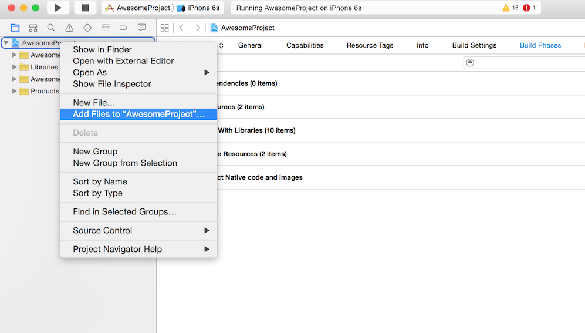
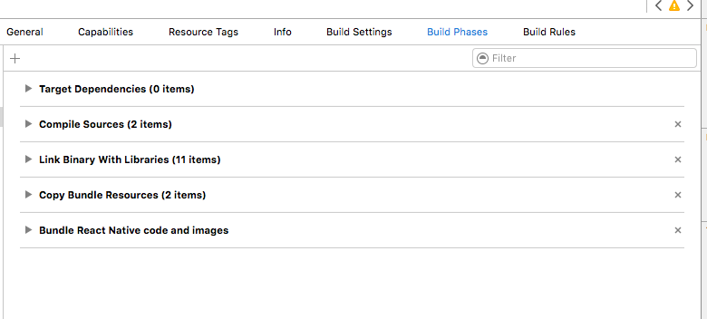
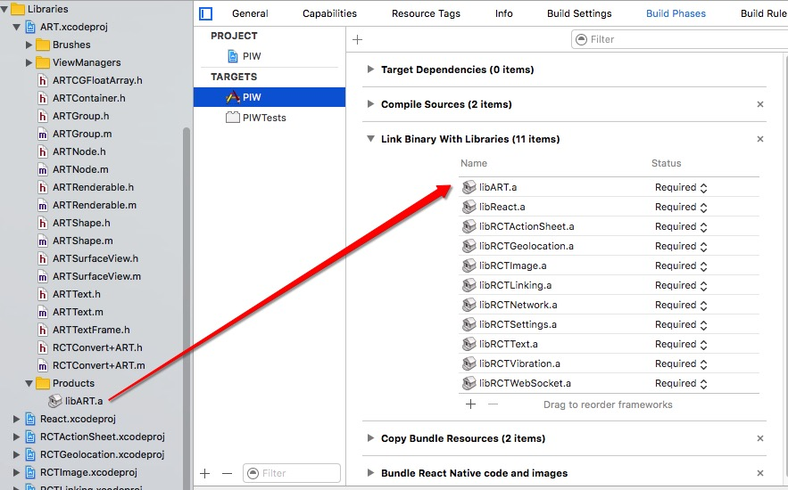

1. Xcode 打开 IOS 项目
2. 右键选择 [你的项目] --> `Add Files to <ProjectName>`

3. 在 `[RN项目根目录]/node_modules/react-native/Libraries/ART`, 选中 `ART.xcodeproj`
4. 定位到 `Build Phases` (友情提示：它与 General, Capabilities 等同级)。

5. 将 `ART.xcodeproj/Products`下的 `libART.a `拖拽到 `Build Phases` 下的 `Link Binary With Libraries` 条目下。

